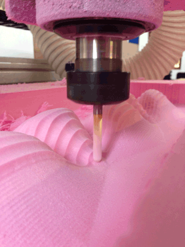

# Carving the Future




---

CEPT University Faculty of Design & FabLab CEPT
**Course** 2090
**Credits** 3  
**Location** FabLab CEPT  
**Timings** Friday, 1430 - 1730  

Henry G. Skupniewicz  
FabLab CEPT  
+91 9825 014578 (SMS only)  
`HenrySkup@gmail.com`  

---

**Computer-Numerical-Control** (CNC) has completely changed the way we fabricate.  Now, a design can be drafted in CAD on one side of the globe and manufactured on the other side.  Yet, with these great opportunities comes the stipulation that we learn the craft of this technique.  CNC may seem like magic, but it requires lots of practice, thought, and knowledge.

In this class, students will learn how to design for CNC machines (both large and small formats) through hands-on experimentation.  Additionally, the class will be explored how this manufacturing technique can fit into a larger toolchain -- be it casting, assembly, or surface modeling.

The class is limited in size to facilitate access and participation.  **Students are required to attend all classes as well as to spend time outside of class time in order to complete all work.**  Students must be CAD competent (Rhino preferred).

---

## Schedule

> For a more detailed, class-by-class breakdown, please see the class notes.

This semester is made up of 15 classes (numbered 0-14), the final one being a Final Jury. Please note the class (6 March, 2015) missed due to Dhuleti.  Below is a list of how the semester will be broken up with important dates noted.


| Class                                               | Date         | Notes          | Assignment                            |
|-----------------------------------------------------|--------------|----------------|---------------------------------------|
| 0 : Hello, World!  Hello, Class!                    | 9 January    |                |                                       |
| 1 :                                                 | 16 January   |                |                                       |
| 2 :                                                 | 23 January   |                |                                       |
| 3 :                                                 | 30 January   |                |                                       |
| 4 :                                                 | 6 February   |                |                                       |
| 5 :                                                 | 13 February  |                |                                       |
| 6 :                                                 | 20 February  |                |                                       |
| 7 :                                                 | 27 February  |                |                                       |
|                                                     | 6 March      | **No Class** |                                       |
| 8 :                                                 | 13 March     |                |                                       |
| 9 :                                                 | 20 March     |                |                                       |
| 10 :                                                | 27 March     |                |                                       |
| 11 :                                                | 3 April      |                |                                       |
| 12 :                                                | 10 April     |                |                                       |
| 13 :                                                | 17 April     |                |                                       |
| 14 : **Final Jury**                               | 24 April     | Location TBA   |                                       |

---

## Assignments and Expectations

> For policies regarding assignments, please see the [Policies section below](#policies).

There will be two types of assignments given out in this class.  **All are mandatory and due dates are strict to ensure proper credit is due.**

###### Weekly Assignments

These will be a combination of short readings and small projects that *will require work outside of class*.  They are formulated so that you will be able to accomplish them with the help of FabLab CEPT and other local resources.  
**Due one week from assigned date.**  

###### Projects

These are multi-week assignments that will culminate in either a final or mid-term.  Students will have to self-pace for proper completion of the assignment.  
**Due-date notified at time of assignment.**

---

## Policies, et al.

### Attendance & Due Dates

Attendance to *all lectures* is mandatory.  

Of course, if there are circumstances that dictate, absence is acceptable if:

1. Prior notice is given **by the student him/her-self**.

2. Total number of absences throughout the semester is *reasonable* (as decided by faculty).

Submissions for work will be strict, though exceptions are possible - they will be granted according to the same criteria above.

### Grading

**All students** are expected to contribute towards the class whether or not they are receiving a final grade toward their GPA or receiving a P/F.  The final make-up of the grade will be decided by the faculty.

##### Grading will be based on:

* **Participation**: This is more than just attendance, this includes active interaction in discussions and group work.

* **Quality of work & process**: Showing a successful design process (which culminates in fine work) is the standard.

* **Attendance & Due Dates**: Attendance and submissions will be recorded and will be used in grading.

##### A note on group work

Group work is a basic part of life and grading is comprised of two parts: **the individual** and **the group**.  Each is assessed based on both the ideal (ex. the quality of the work) as well as the mitigating circumstances (ex. group dynamic/abiliteis).  *Weight will be given toward the quality of the group work.*

In the end, group work will be successful if every group member does to the best of *their own abilities*.  This **does not** mean that all work will be split equally, it means that **the work** has to get done, somehow, someway.

### Academic Integrity

The purpose of education is promote and expand the truth.  Collaboration and building off the work of others are, of course, the corner-stones of academic research, but must be used with integrity.  Thus, all work must be presented with *honesty* as the foundational criterion.

Students must:

* Appropriately cite any and all work (papers, images, videos, etc.) that contributed toward their work.

* Properly acknowledge collaboration (of any type) that contributed toward their work.

* Request information from faculty regarding questions before submission of work.

Any act of plagiarism, cheating, or other act of academic dishonesty will be addressed on a case-by-case basis, but may be considered a serious offense.

Any questions about citation, research, or those in regards to this policy should be referred to ```fablab@cept.ac.in```.

*This policy is heavily influenced by those of MIT (Cambridge, MA).  For more information see ```integrity.mit.edu```.*

### Code of Conduct

All students (and others) are required to treat themselves, those around them, their environment with the upmost respect.  Discrimination, harassment, violence, etc. of any kind, is unacceptable and **will be handled with all seriousness**.  

Any questions in regards to this policy should be referred to ```fablab@cept.ac.in```.

### License  

All materials are licensed under the MIT License.
